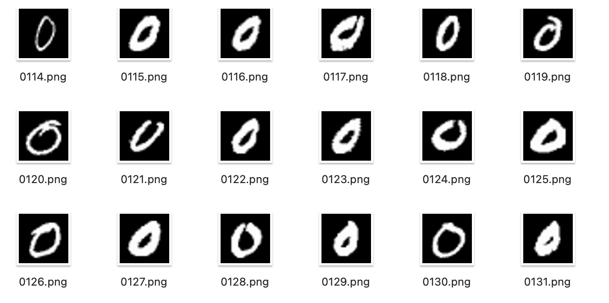
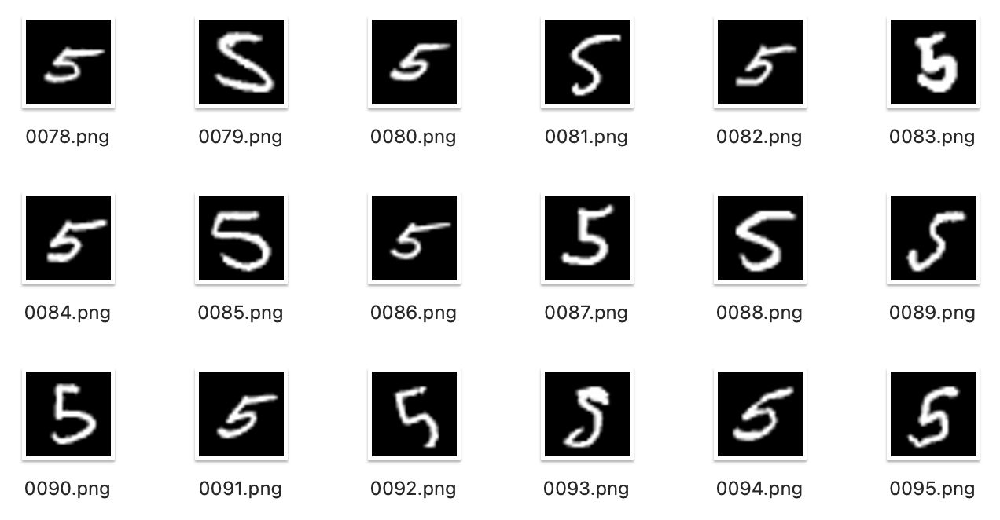

# Dump MNIST data

Get MNIST data and export them as png files.

## Usage

You need `tensorflow` and `Pillow`. You can install them via pip.

```sh
python3 -m pip install tensorflow Pillow
```

Or, you can create a virtual environemnt.

```sh
git clone https://github.com/kaityo256/mnist_dump_tf.git
cd mnist_dump_tf
python3 -m venv tf
source tf/bin/activate
python3 -m pip install tensorflow Pillow
```

Then you can run the script as follows.

```sh
python3 mnist_dump_tf.py
```

This script will create directories `train` and `test`, and dumps images to them.

The dumped images are as follows.




## License

MIT
